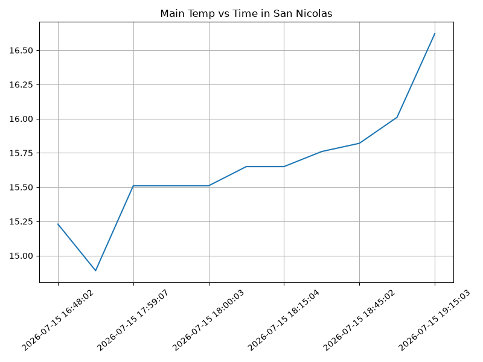
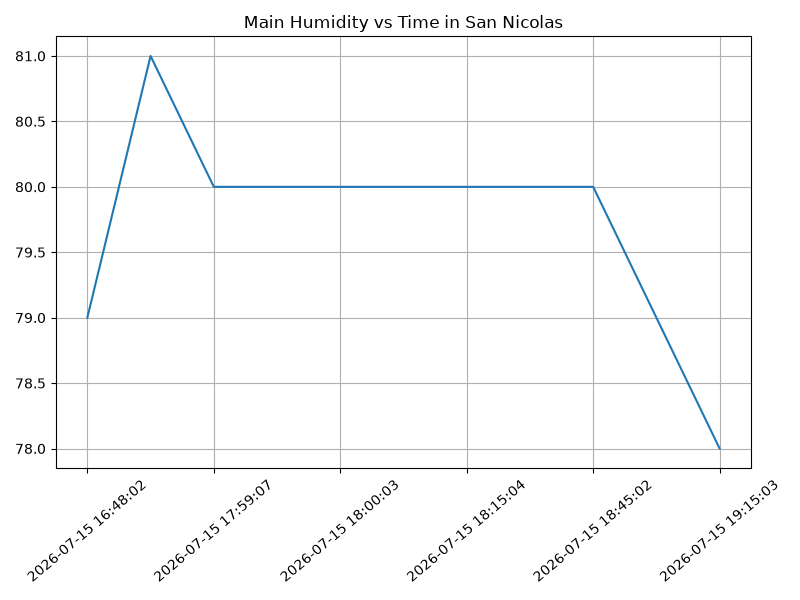
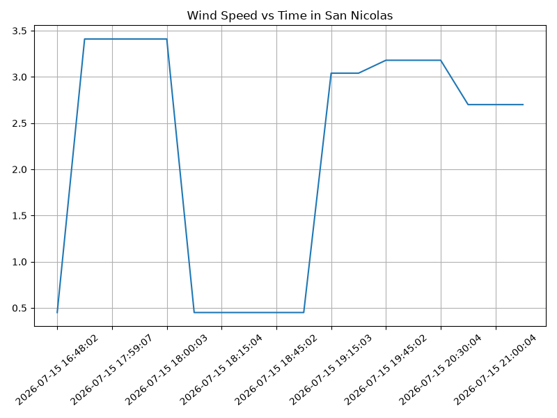

#+options: ':nil *:t -:t ::t <:t H:3 \n:nil ^:t arch:headline
#+options: author:t broken-links:nil c:nil creator:nil
#+options: d:(not "LOGBOOK") date:t e:t email:nil expand-links:t f:t
#+options: inline:t num:t p:nil pri:nil prop:nil stat:t tags:t
#+options: tasks:t tex:t timestamp:t title:t toc:t todo:t |:t
#+title: Proyecto ICCD332 Arquitectura de Computadores
#+date: 2026-07-16
#+author: Echeverría Steven, Jami Mateo, Pérez Martín y Zúñiga Sebastián.
#+email: sebastian.zuniga@epn.edu.ec
#+language: es
#+select_tags: export
#+exclude_tags: noexport
#+creator: Emacs 27.1 (Org mode 9.7.5)
#+cite_export:

* City Weather APP
Este es el proyecto de fin de semestre en donde se pretende demostrar
las destrezas obtenidas durante el transcurso de la asignatura de
**Arquitectura de Computadores**.

1. Conocimientos de sistema operativo Linux
2. Conocimientos de Emacs/Jupyter
3. Configuración de Entorno para Data Science con Mamba/Anaconda
4. Literate Programming

* Índice de Secciones del Proyecto
 
** Estructura del proyecto
nSe recomienda que el proyecto se cree en el /home/ del sistema
operativo i.e. /home/<user>/. Allí se creará la carpeta /CityWeather/
#+begin_src shell :results output :exports both
mkdir BuenosAiresWeather
cd BuenosAiresWeather
pwd
#+end_src

#+RESULTS:
: /home/sebaszun-epn/BuenosAiresWeather

El proyecto ha de tener los siguientes archivos y
subdirectorios. Adaptar los nombres de los archivos según las ciudades
específicas del grupo.

#+begin_src shell :results output :exports results
cd ..
cd ..
tree
#+end_src

#+RESULTS:
#+begin_example
.
├── CityTemperatureAnalysis.ipynb
├── clima-quito-hoy.csv
├── get-weather.sh
├── main.py
├── output.log
└── weather-site
    ├── build-site.el
    ├── build.sh
    ├── content
    │   ├── images
    │   │   ├── plot.png
    │   │   └── temperature.png
    │   ├── index.org
    │   └── index.org_archive
    └── public
        ├── images
        │   ├── plot.png
        │   └── temperature.png
        ├── index.html
        

5 directories, 18 files
#+end_example

Puede usar Emacs para la creación de la estructura de su proyecto
usando comandos desde el bloque de shell. Recuerde ejecutar el bloque
con ~C-c C-c~. Para insertar un bloque nuevo utilice ~C-c C-,~ o ~M-x
org-insert-structure-template~. Seleccione la opción /s/ para src y
adapte el bloque según su código tenga un comandos de shell, código de
Python o de Java. En este documento ~.org~ dispone de varios ejemplos
funcionales para escribir y presentar el código.

#+begin_src shell :results output :exports both
pwd
cd BuenosAiresWeather
mkdir weather-site
cd weather-site
mkdir content
cd content
mkdir images
cd ..
mkdir public
cd public
mkdir images
cd ..
cd ..
tree
#+end_src

#+RESULTS:
: /home/sebaszun-epn
: .
: └── weather-site
:     ├── content
:     │   └── images
:     └── public
:         └── images
: 
: 6 directories, 0 files

Una vez realizadas las demás secciones del presente proyecto, se
procedió a actualizar la organización de los direcctorios

#+begin_src shell :results output :exports both
pwd
cd ~/BuenosAiresWeather/
cp build.* ~/BuenosAiresWeather/weather-site/
cp -r ~/BuenosAiresWeather/weather-site/content/images/ ~/BuenosAiresWeather/weather-site/public/
#+end_src

** Formulación del Problema
Se desea realizar un registro climatológico de una ciudad
$\mathcal{C}$. Para esto, escriba un script de Python/Java que permita
obtener datos climatológicos desde el API de [[https://openweathermap.org/current#one][openweathermap]]. El API
hace uso de los valores de latitud $x$ y longitud $y$ de la ciudad
$\mathcal{C}$ para devolver los valores actuales a un tiempo $t$.

Los resultados obtenidos de la consulta al API se escriben en un
archivo /clima-<ciudad>-hoy.csv/. Cada ejecución del script debe
almacenar nuevos datos en el archivo. Utilice *crontab* y sus
conocimientos de Linux y Programación para obtener datos del API de
/openweathermap/ con una periodicidad de 15 minutos mediante la
ejecución de un archivo ejecutable denominado
/get-weather.sh/. Obtenga al menos 50 datos. Verifique los
resultados. Todas las operaciones se realizan en Linux o en el
WSL. Las etapas del problema se subdividen en:

    1. Conformar los grupos de 2 estudiantes y definir la ciudad
       objeto de estudio.
    2.  Crear su API gratuito en [[https://openweathermap.org/current#one][openweathermap]]
    3. Escribir un script en Python/Java que realice la consulta al
       API y escriba los resultados en /clima-<ciudad>-hoy.csv/. El
       archivo ha de contener toda la información que se obtiene del
       API en columnas. Se debe observar que los datos sobre lluvia
       (rain) y nieve (snow) se dan a veces si existe el fenómeno.
    3. Desarrollar un ejecutable /get-weather.sh/ para ejecutar el
       programa Python/Java.[fn:1]
       #+begin_src shell :exports both
         
       #+end_src
    4. Configurar Crontab para la adquisición de datos. Escriba el
       comando configurado. Respalde la ejecución de crontab en un
       archivo output.log
    5. Realizar la presentación del Trabajo utilizando la generación
       del sitio web por medio de Emacs. Para esto es necesario crear
       la carpeta **weather-site** dentro del proyecto. Puede ajustar el
       /look and feel/ según sus preferencias. El servidor a usar es
       el **simple-httpd** integrado en Emacs que debe ser instalado:
       - Usando comandos Emacs: ~M-x package-install~ presionamos
         enter (i.e. RET) y escribimos el nombre del paquete:
         simple-httpd
       - Configurando el archivo init.el

       #+begin_src elisp

         (package-install 'simple-httpd)
         (use-package simple-httpd
            :ensure t)
         (package-installed-p 'simple-httpd)
       #+end_src

       #+RESULTS:
       : t

       Instrucciones de sobre la creación del sitio web se tiene en el
       vídeo de instrucciones y en el archivo [[https://github.com/LeninGF/EPN-Lectures/blob/main/iccd332ArqComp-2024-A/Tutoriales/Org-Website/Org-Website.org][Org-Website.org]] en el
       GitHub del curso

    6. Su código debe estar respaldado en GitHub/BitBucket, la
       dirección será remitida en la contestación de la tarea
** Descripción del código
En esta sección se detalla la estrategia de solución adoptada para el
procesamiento dinámico y almacenamiento del clima de Buenos Aires.

*** Lectura del API
Para obtener los datos climáticos de Buenos Aires en tiempo real, se
realiza una petición HTTP GET utilizando la librería =requests=,
consultando el endpoint de OpenWeatherMap con parámetros de latitud y
longitud configurados para unidades métricas (°C y m/s).

#+begin_src python :session :results output :exports both
import requests
API_KEY = "62d2107136670bd7f62c2c23cea30130"
LAT = -34.6037
LON = -58.3816
URL = f"https://api.openweathermap.org/data/2.5/weather?lat={LAT}&lon={LON}&appid={API_KEY}&units=metric"

response = requests.get(URL)
print(response.status_code)
#+end_src

#+RESULTS:
: 200

*** Convertir /Json/ a /Diccionario/ de Python (Normalización)
La respuesta que nos da la API viene en un formato llamado JSON y la
convierte en en una tabla limpia usando la librería Pandas. Además, se
agrega una columna con la fecha y hora exacta de la consulta (=dt=)
para saber exactamente cuándo se tomaron los datos.

#+begin_src python :session :results output :exports both
import pandas as pd
from datetime import datetime

data = response.json()
df_new = pd.json_normalize(data)
df_new['dt'] = datetime.now().strftime('%Y-%m-%d %H:%M:%S')
print(df_new[['name', 'main.temp', 'dt']].to_string(index=False))
#+end_src

*** Guardar el archivo csv
Para asegurarnos de que el programa no falle si faltan datos (como cuando no está lloviendo), el script primero revisa si el archivo CSV ya existe en la carpeta. Si el archivo ya está creado, lo abre y le pega los datos nuevos al final para no borrar lo que guardaron tus compañeros[cite: 2]. Si el archivo no existe, lo crea por primera vez.

#+begin_src python :session :results output :exports both
import os

csv_path = 'clima-buenosaires-hoy.csv'
if os.path.exists(csv_path):
    df_existing = pd.read_csv(csv_path)
    df_all = pd.concat([df_existing, df_new], ignore_index=True)
    df_all.to_csv(csv_path, index=False)
else:
    df_new.to_csv(csv_path, index=False)
print("CSV actualizado con éxito.")
#+end_src

** Script ejecutable sh
Se coloca el contenido del script ejecutable. Para evitar fallos con
el comando =source= en la terminal, se utiliza el intérprete de
comandos =/bin/bash= en lugar de =sh= estándar. Además, se definieron
rutas relativas a la carpeta personal del usuario (=~/=) para asegurar
que el script se ejecute correctamente en el sistema de cualquier
miembro del grupo.

El archivo ejecutable =get-weather.sh= contiene la siguiente
estructura para cargar de forma segura el entorno de
**anaconda/mamba** denominado **iccd332**:

#+begin_src shell :exports both
#!/bin/bash
# Cargar conda de forma segura usando el home genérico (~/)
if [ -f ~/miniforge3/etc/profile.d/conda.sh ]; then
    source ~/miniforge3/etc/profile.d/conda.sh
elif [ -f ~/miniconda3/etc/profile.d/conda.sh ]; then
    source ~/miniconda3/etc/profile.d/conda.sh
elif [ -f ~/anaconda3/etc/profile.d/conda.sh ]; then
    source ~/anaconda3/etc/profile.d/conda.sh
fi

# Activar el entorno de la materia
conda activate iccd332

# Moverse a la carpeta del proyecto y ejecutar
cd ~/BuenosAiresWeather
python main.py
#+end_src

Finalmente, se convierte en ejecutable dándole permisos de lectura y
ejecución en el sistema operativo:

#+begin_src shell :exports both
chmod +x get-weather.sh
#+end_src

En el caso de los shell script se puede usar `which sh` para conocer
la ubicación del ejecutable
#+begin_src shell :results output :exports both
which sh
#+end_src

#+RESULTS:
: /usr/bin/sh

De igual manera se requiere localizar el entorno de mamba *iccd332*
que será utilizado

#+begin_src shell :results output :exports both
which mamba
#+end_src

#+RESULTS:
: /home/leningfe/miniforge3/condabin/mamba

Con esto el archivo ejecutable a de tener (adapte el código según las
condiciones de su máquina):

#+begin_src shell :results output :exports both
#!/usr/bin/sh
source /home/<user>/miniforge3/etc/profile.d/conda.sh
eval "$(conda shell.bash hook)"
conda activate iccd332
Python main.py
#+end_src

Finalmente convierta en ejecutable como se explicó en clases y laboratorio
#+begin_src shell :results output :exports both
#!/usr/bin/sh
Poner comando/s aquí
#+end_src

** Configuración de Crontab
Se indica la configuración realizada en crontab para la adquisición de
datos de manera automática cada 15 minutos:

#+begin_src shell
*/15 * * * * cd ~/BuenosAiresWeather && ./get-weather.sh >> output.log 2>&1
#+end_src

- Recuerde remplazar <City> por el nombre de la ciudad que analice
- Recuerde ajustar el tiempo para potenciar tomar datos nuevos
- Recuerde que ~2>&1~ permite guardar en ~output.log~ tanto la salida
  del programa como los errores en la ejecución.
* Presentación de resultados
Para la pressentación de resultados se utilizan las librerías de Python:
- matplotlib
- pandas

Alternativamente como pudo estudiar en el Jupyter Notebook
[[https://github.com/LeninGF/EPN-Lectures/blob/main/iccd332ArqComp-2024-A/Proyectos/CityWeather/CityTemperatureAnalysis.ipynb][CityTemperatureAnalysis.ipynb]], existen librerías alternativas que se
pueden utilizar para presentar los resultados gráficos. En ambos
casos, para que funcione los siguientes bloques de código, es
necesario que realice la instalación de los paquetes usando ~mamba
install <nombre-paquete>~
** Muestra Aleatoria de datos
Se presenta una muestra de 10 valores aleatorios de los datos obtenidos.
#+caption: Lectura de archivo csv
#+begin_src python :session :results output exports both
import os
import pandas as pd
# lectura del archivo csv obtenido
df = pd.read_csv('/home/mateoijt-epn/ProyectoFinal/BuenosAiresWeather/clima-buenosaires-hoy.csv')
# se imprime la estructura del dataframe en forma de filas x columnas
print(df.shape)
#+end_src

#+RESULTS:
: (18, 27)

Resultado del número de filas y columnas leídos del archivo csv

#+caption: Despliegue de datos aleatorios
#+begin_src python :session :exports both :results value table :return table
table1 = df.sample(10)
table = [list(table1)]+[None]+table1.values.tolist()
#+end_src

#+RESULTS:
| weather                                                                          | base     | visibility | dt                  | timezone |      id | name        | cod | coord.lon | coord.lat | main.temp | main.feels_like | main.temp_min | main.temp_max | main.pressure | main.humidity | main.sea_level | main.grnd_level | wind.speed | wind.deg | wind.gust | clouds.all | sys.type |  sys.id | sys.country | sys.sunrise | sys.sunset |
|----------------------------------------------------------------------------------+----------+------------+---------------------+----------+---------+-------------+-----+-----------+-----------+-----------+-----------------+---------------+---------------+---------------+---------------+----------------+-----------------+------------+----------+-----------+------------+----------+---------+-------------+-------------+------------|
| [{'id': 804, 'main': 'Clouds', 'description': 'overcast clouds', 'icon': '04n'}] | stations |      10000 | 2026-07-15 20:00:03 |   -10800 | 6693229 | San Nicolas | 200 |  -58.3816 |  -34.6037 |     16.62 |            16.4 |         14.93 |         17.26 |          1009 |            79 |           1009 |            1008 |       3.18 |       49 |      7.27 |        100 |        2 | 2020613 | AR          |  1784113074 | 1784149239 |
| [{'id': 804, 'main': 'Clouds', 'description': 'overcast clouds', 'icon': '04n'}] | stations |      10000 | 2026-07-15 17:59:41 |   -10800 | 6693229 | San Nicolas | 200 |  -58.3816 |  -34.6037 |     15.51 |           15.21 |         14.37 |         16.61 |          1009 |            80 |           1009 |            1008 |       3.41 |       45 |      7.87 |        100 |        2 | 2031595 | AR          |  1784113074 | 1784149239 |
| [{'id': 804, 'main': 'Clouds', 'description': 'overcast clouds', 'icon': '04n'}] | stations |      10000 | 2026-07-15 18:07:18 |   -10800 | 6693229 | San Nicolas | 200 |  -58.3816 |  -34.6037 |     15.65 |           15.36 |         14.37 |         16.61 |          1009 |            80 |           1009 |            1008 |       0.45 |       23 |      0.89 |        100 |        2 | 2031595 | AR          |  1784113074 | 1784149239 |
| [{'id': 804, 'main': 'Clouds', 'description': 'overcast clouds', 'icon': '04n'}] | stations |      10000 | 2026-07-15 19:45:02 |   -10800 | 6693229 | San Nicolas | 200 |  -58.3816 |  -34.6037 |     16.56 |           16.33 |         14.93 |         17.26 |          1009 |            79 |           1009 |            1008 |       3.18 |       49 |      7.27 |        100 |        2 | 2020613 | AR          |  1784113074 | 1784149239 |
| [{'id': 804, 'main': 'Clouds', 'description': 'overcast clouds', 'icon': '04n'}] | stations |      10000 | 2026-07-15 18:45:02 |   -10800 | 6693229 | San Nicolas | 200 |  -58.3816 |  -34.6037 |     15.82 |           15.55 |         14.88 |         16.61 |          1009 |            80 |           1009 |            1008 |       0.45 |       45 |      1.79 |        100 |        2 | 2031595 | AR          |  1784113074 | 1784149239 |
| [{'id': 804, 'main': 'Clouds', 'description': 'overcast clouds', 'icon': '04n'}] | stations |      10000 | 2026-07-15 18:30:03 |   -10800 | 6693229 | San Nicolas | 200 |  -58.3816 |  -34.6037 |     15.76 |           15.48 |         14.37 |         16.61 |          1009 |            80 |           1009 |            1008 |       0.45 |       45 |      1.79 |        100 |        2 | 2031595 | AR          |  1784113074 | 1784149239 |
| [{'id': 804, 'main': 'Clouds', 'description': 'overcast clouds', 'icon': '04n'}] | stations |      10000 | 2026-07-15 21:15:05 |   -10800 | 6693229 | San Nicolas | 200 |  -58.3816 |  -34.6037 |     15.92 |           15.66 |          15.4 |         16.61 |          1009 |            80 |           1009 |            1008 |        2.7 |       50 |      5.48 |        100 |        2 | 2031595 | AR          |  1784113074 | 1784149239 |
| [{'id': 804, 'main': 'Clouds', 'description': 'overcast clouds', 'icon': '04n'}] | stations |      10000 | 2026-07-15 19:15:03 |   -10800 | 6693229 | San Nicolas | 200 |  -58.3816 |  -34.6037 |     16.62 |           16.37 |         15.44 |         17.26 |          1009 |            78 |           1009 |            1008 |       3.04 |       49 |      7.22 |        100 |        2 | 2020613 | AR          |  1784113074 | 1784149239 |
| [{'id': 804, 'main': 'Clouds', 'description': 'overcast clouds', 'icon': '04n'}] | stations |      10000 | 2026-07-15 16:48:02 |   -10800 | 6693229 | San Nicolas | 200 |  -58.3816 |  -34.6037 |     15.23 |           14.87 |         13.82 |         16.05 |          1008 |            79 |           1008 |            1007 |       0.45 |       23 |      0.89 |        100 |        2 | 2031595 | AR          |  1784113074 | 1784149239 |
| [{'id': 804, 'main': 'Clouds', 'description': 'overcast clouds', 'icon': '04n'}] | stations |      10000 | 2026-07-15 17:59:07 |   -10800 | 6693229 | San Nicolas | 200 |  -58.3816 |  -34.6037 |     15.51 |           15.21 |         14.37 |         16.61 |          1009 |            80 |           1009 |            1008 |       3.41 |       45 |      7.87 |        100 |        2 | 2031595 | AR          |  1784113074 | 1784149239 |

** Gráfica Temperatura vs Tiempo

#+begin_src python :results file :exports both :session
import matplotlib.pyplot as plt
import matplotlib.dates as mdates
# Define el tamaño de la figura de salida
fig = plt.figure(figsize=(8,6))
plt.plot(df['dt'], df['main.temp']) # dibuja las variables dt y temperatura
# ajuste para presentacion de fechas en la imagen 
plt.gca().xaxis.set_major_locator(mdates.DayLocator(interval=2))
# plt.gca().xaxis.set_major_formatter(mdates.DateFormatter('%Y-%m-%d'))  
plt.grid()
# Titulo que obtiene el nombre de la ciudad del DataFrame
plt.title(f'Main Temp vs Time in {next(iter(set(df.name)))}')
plt.xticks(rotation=40) # rotación de las etiquetas 40°
fig.tight_layout()
fname = './images/temperature.png'
plt.savefig(fname)
fname
#+end_src

#+caption: Gráfica Temperatura vs Tiempo
#+RESULTS:

** Gráfica Humedad vs Tiempo

#+begin_src python :results file :exports both :session
import matplotlib.pyplot as plt
import matplotlib.dates as mdates
# Define el tamaño de la figura de salida
fig = plt.figure(figsize=(8,6))
plt.plot(df['dt'], df['main.humidity']) # dibuja las variables dt y humedad
# ajuste para presentacion de fechas en la imagen 
plt.gca().xaxis.set_major_locator(mdates.DayLocator(interval=2))
# plt.gca().xaxis.set_major_formatter(mdates.DateFormatter('%Y-%m-%d'))  
plt.grid()
# Titulo que obtiene el nombre de la ciudad del DataFrame
plt.title(f'Main Humidity vs Time in {next(iter(set(df.name)))}')
plt.xticks(rotation=40) # rotación de las etiquetas 40°
fig.tight_layout()
fname = './images/humidity.png'
plt.savefig(fname)
fname
#+end_src

#+RESULTS:

** Gráfica Velocidad del Viento vs Tiempo

#+begin_src python :results file :exports both :session
import matplotlib.pyplot as plt
import matplotlib.dates as mdates
# Define el tamaño de la figura de salida
fig = plt.figure(figsize=(8,6))
plt.plot(df['dt'], df['wind.speed']) # dibuja las variables dt y velocidad del viento
# ajuste para presentacion de fechas en la imagen 
plt.gca().xaxis.set_major_locator(mdates.DayLocator(interval=2))
# plt.gca().xaxis.set_major_formatter(mdates.DateFormatter('%Y-%m-%d'))  
plt.grid()
# Titulo que obtiene el nombre de la ciudad del DataFrame
plt.title(f'Wind Speed vs Time in {next(iter(set(df.name)))}')
plt.xticks(rotation=40) # rotación de las etiquetas 40°
fig.tight_layout()
fname = './images/wind_speed.png'
plt.savefig(fname)
fname
#+end_src

#+RESULTS:

Debido a que el archivo index.org se abre dentro de la carpeta
/content/, y en cambio el servidor http de emacs se ejecuta desde la
carpeta /public/ es necesario copiar el archivo a la ubicación
equivalente en ~/public/images~

#+begin_src shell
cp -rfv ./images/* ~/ProyectoFinal/BuenosAiresWeather/weather-site/public/images
#+end_src

#+RESULTS:
| './images/denuncias_canton.png' | -> | '/home/mateoijt-epn/ProyectoFinal/BuenosAiresWeather/weather-site/public/images/denuncias_canton.png' |
| './images/denuncias_tiempo.png' | -> | '/home/mateoijt-epn/ProyectoFinal/BuenosAiresWeather/weather-site/public/images/denuncias_tiempo.png' |
| './images/humidity.png'         | -> | '/home/mateoijt-epn/ProyectoFinal/BuenosAiresWeather/weather-site/public/images/humidity.png'         |
| './images/temperature.png'      | -> | '/home/mateoijt-epn/ProyectoFinal/BuenosAiresWeather/weather-site/public/images/temperature.png'      |
| './images/wind_speed.png'       | -> | '/home/mateoijt-epn/ProyectoFinal/BuenosAiresWeather/weather-site/public/images/wind_speed.png'       |

* Sección: Buenos Aires Weather
- [[file:buenos_aires_weather.org][Ir a la sección de Buenos Aires Weather]]

* Sección: Conversión a IEEE 754
- [[file:ieee754.org][Ir a la sección de Conversión IEEE 754]]

* Sección: Analisis de Robos Unidades Económicas
- [[file:procesamiento_robos.org][Ir a la sección de Análisis de Robos Unidades Económicas]]
* Referencias
- [[https://emacs.stackexchange.com/questions/28715/get-pandas-data-frame-as-a-table-in-org-babel][presentar dataframe como tabla en emacs org]]
- [[https://orgmode.org/worg/org-contrib/babel/languages/ob-doc-python.html][Python Source Code Blocks in Org Mode]]
- [[https://systemcrafters.net/publishing-websites-with-org-mode/building-the-site/][Systems Crafters Construir tu sitio web con Modo Emacs Org]]
- [[https://www.youtube.com/watch?v=AfkrzFodoNw][Vídeo Youtube Build Your Website with Org Mode]]
* Footnotes

[fn:1] Recuerde que su máquina ha de disponer de un entorno de
anaconda/mamba denominado iccd332 en el cual se dispone del interprete
de Python
